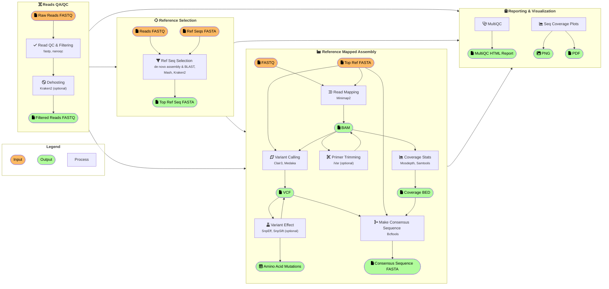

# CFIA-NCFAD/nf-virontus

[](https://github.com/CFIA-NCFAD/nf-virontus/actions/workflows/ci.yml)
[](https://github.com/CFIA-NCFAD/nf-virontus/actions/workflows/linting.yml)
[](https://zenodo.org/doi/10.5281/zenodo.10369022)

[](https://www.nextflow.io/)
[](https://docs.conda.io/en/latest/)
[](https://www.docker.com/)
[](https://sylabs.io/docs/)

Oxford Nanopore viral sequence analysis pipeline.

## Introduction

This pipeline performs read mapping and variant calling with [Minimap2] and [Clair3]. A consensus sequence is generated from major variants and variants that would not cause potential frameshift mutations using [Bcftools] with masking of low coverage depth regions with `N` characters.

Optionally, amplicon primers can be trimmed with [iVar] if a BED file of primer coordinates is supplied.

If read mapping against the SARS-CoV-2 reference genome Wuhan-Hu-1 ([MN908947.3](https://www.ncbi.nlm.nih.gov/nuccore/MN908947.3/)), [Pangolin] lineage assignment will be done, as well as, [Nextclade] analysis.

## Pipeline Overview

>*NOTE:* This pipeline is still a work-in-progress. The following diagram shows the planned features and steps of the workflow:



## Installation

You will need to install [Nextflow] in order to run the Virontus pipeline.

> **NB:** [Singularity] or [Docker] is recommended for portable and reproducible execution of the pipeline with the `-profile singularity` or `-profile docker` command-line argument.

### 1) Install [Nextflow]

If you have [Conda] installed, you can install [Nextflow] with the following command:

```bash
conda install -c bioconda -c conda-forge nextflow
```

### 2) Install [Docker][] and/or [Singularity][]

Installing [Docker][] and/or [Singularity] is optional but recommended for portability and reproducibility of results.

### 3) Install Virontus

Nextflow will automatically download the latest version of Virontus. You can show the Virontus help message with usage information with:

```bash
nextflow run CFIA-NCFAD/nf-virontus --help
```

## Usage

Basic usage for mapping to SARS-CoV-2 reference genome [MN908947.3](https://www.ncbi.nlm.nih.gov/nuccore/MN908947.3/) and [ARTIC V3 protocol](https://github.com/artic-network/artic-ncov2019/tree/master/primer_schemes/nCoV-2019/V3) primers:

```bash
nextflow run CFIA-NCFAD/nf-virontus \
  --input samplesheet.csv \
  --genome MN908947.3 \
  --bed artic-ncov2019/primer_schemes/nCoV-2019/V3/nCoV-2019.bed
```

Can be simplified with:

```bash
nextflow run CFIA-NCFAD/nf-virontus \
  --input samplesheet.csv \
  --scov2 \
  --artic_v3
  # or `--freed` for Freed et al (2020) 1200bp amplicon method
```

Show usage information with

```bash
nextflow run CFIA-NCFAD/nf-virontus --help
```

> **NB:** See the [usage docs](docs/usage.md) for more info.

## Output

See the [output docs](docs/output.md) for more info.

## Credits

CFIA-NCFAD/nf-virontus was originally written by Peter Kruczkiewicz.

Bootstrapped with [nf-core/tools](https://github.com/nf-core/tools) `nf-core create`.

Thank you to the [nf-core/tools](https://github.com/nf-core/tools) team for a great tool for bootstrapping creation of a production ready Nextflow workflows.

[Bcftools]: https://samtools.github.io/bcftools/bcftools.html
[Conda]: https://conda.io/
[Docker]: https://www.docker.com/
[iVar]: https://github.com/andersen-lab/ivar
[Minimap2]: https://github.com/lh3/minimap2
[Nextflow]: https://www.nextflow.io
[Nextclade]: https://clades.nextstrain.org/
[Pangolin]: https://github.com/cov-lineages/pangolin/
[Singularity]: https://github.com/apptainer/apptainer
